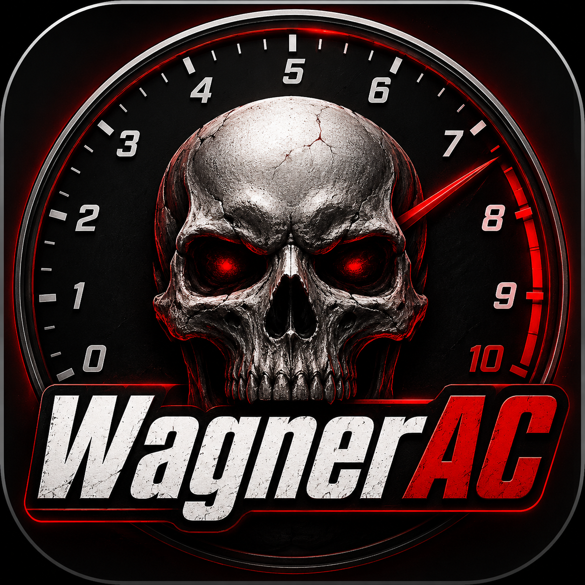

# Wagner — Assetto Corsa Car Data Editor

Desktop app for editing Assetto Corsa `.acd` files. Open any car's `data.acd`, tune everything, save. No install, portable `.exe`.

<p align="center">
  
</p>

## What it does

- **Engine** — rev limiter, turbo boost, power curve (drag points on graph)
- **Drivetrain** — gear ratios, final drive, differential lock
- **Suspension** — springs, dampers, camber, ride height, anti-roll bars
- **Tyres** — pressure, grip, load sensitivity, wear curve
- **Brakes** — max torque, bias
- **Aero** — downforce, drag, wing angles
- **AI** — shift points, throttle/steer aggression, grip multiplier
- **Setup** — in-game setup menu definition

## Live Power Calculator

In the Engine tab, see real-time power and torque updated as you edit the curve or turbo boost. Supports boost multiplier — if the car has a turbo (`WASTEGATE`), power is automatically adjusted.

## Quick Start

1. Download `Wagner.exe` from [Releases](https://github.com/wagnerbtc/wagner/releases)
2. Double-click `Wagner.exe`
3. Open any `data.acd` (drag & drop works)
4. Edit, save

Or from command line:
```
Wagner.exe "C:\Steam\...\cars\bmw_m3\data.acd"
```

Right-click integration available on first run.

## Build from Source

Requirements: Python 3.10+, Windows.

```
git clone https://github.com/wagnerbtc/wagner.git
cd wagner
build.bat
```

Output: `dist\Wagner.exe` (~15 MB, single file).

### Manual build

```bash
python -m venv .venv
.venv\Scripts\activate
pip install git+https://github.com/philippkosarev/acd.git flask pywebview pyinstaller
python build.py
```

## How it works

| Layer | Tech |
|-------|------|
| Backend | Python + Flask (in-memory, 8 API endpoints) |
| Frontend | HTML/CSS/JS (single file, dark theme, no CDN) |
| Window | pywebview (Edge WebView2 on Windows) |
| ACD I/O | [acd](https://github.com/philippkosarev/acd) library |
| Build | PyInstaller, `--onefile --windowed` |

ACD files are XOR-encrypted archives. Key is derived from filename or parent directory name. Wagner reads, decrypts, lets you edit, re-encrypts, and writes back.

## File structure

```
wagner/
├── wagner/
│   ├── __init__.py
│   ├── app.py              # Entry point, webview window, shell registration
│   ├── backend.py           # API: open, read, edit, save, undo, reset, diff, state
│   └── static/
│       └── index.html       # Full SPA: categories, cards, sliders, LUT editor
├── build.py                 # PyInstaller build script
├── build.bat                # One-click Windows build
└── pyproject.toml
```

## Tips

- **Undo** reverts unsaved changes to last saved state
- **Reset** restores the original file from backup (`.bak`)
- **All Files** tab shows every file in the ACD for advanced editing
- Hover any parameter name to see what it does
- Drag points on the power curve graph instead of typing numbers
- Orange dot on a category = unsaved changes there

## License

GPL-2.0
